# **HELM** Lab 1
### 1-Add bitnami helm chart repository in the controlplane node.

```bash
helm repo add bitnami https://charts.bitnami.com/bitnami
```
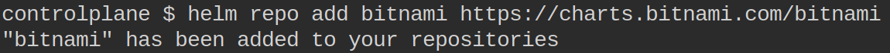
---

### 2-Deploy the Apache application on the cluster using the apache from the bitnami repository.Set the release Name to: amaze-surf

```bash
helm install amaze-surf bitnami/apache
```
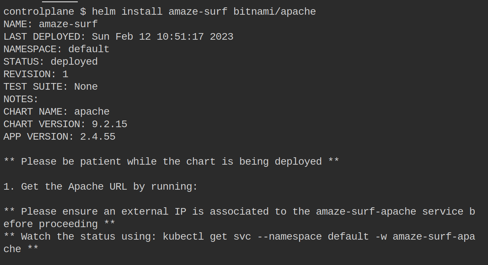
---

### 3-Uninstall the apache chart release  from the cluster

```bash
helm uninstall amaze-surf
```
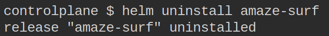
---

### 4- 
#### 1. install specfic version of nginx 1.22.0
```bash
helm search repo  nginx -l | grep 1.22.0
```
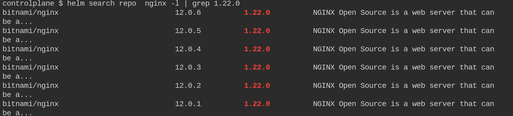
```bash
helm install my-relase-v1 bitnami/nginx --version 12.0.6
```
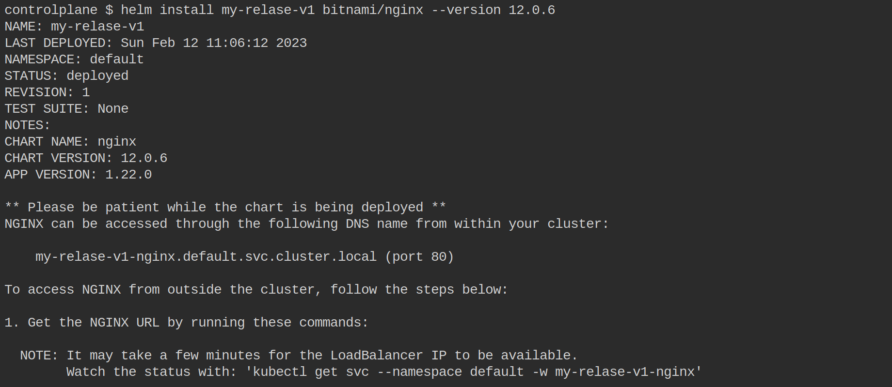
#### 2. then update it to specfic 1.23.1 
```bash
helm search repo  nginx -l | grep 1.23.1
```
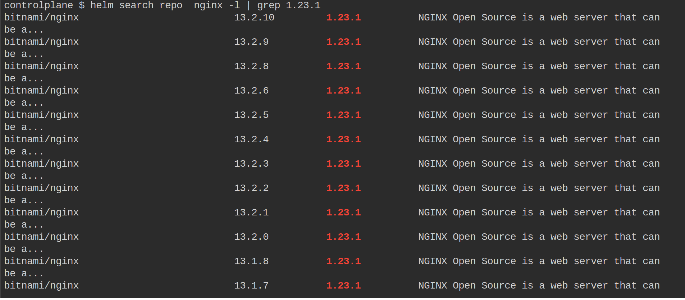
```bash
helm upgrade my-relase-v1 bitnami/nginx --version 13.2.10
```
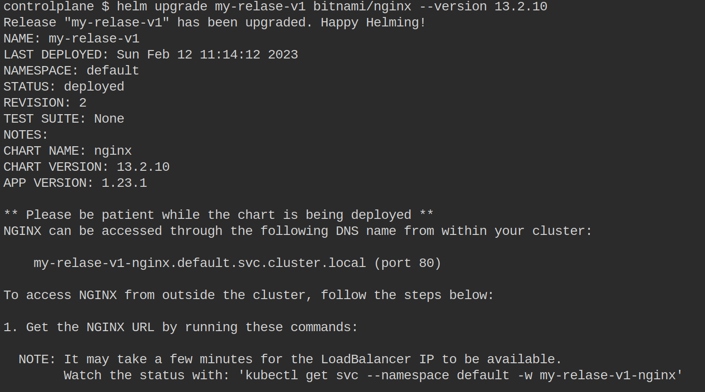
#### 3.then rollback
```bash
helm history my-relase-v1
```
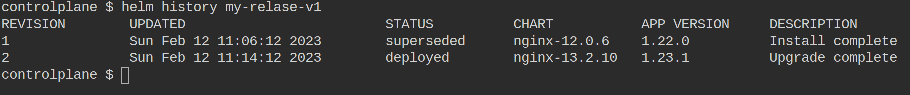
```bash
helm rollback my-relase-v1 1  
```
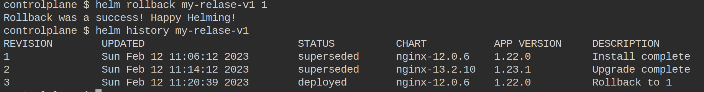

# **HELM** Lab 2
## Deploying [python app](https://github.com/atefhares/DevOps-Challenge-Demo-Code) using local **helm** chart that we build
### we used the redis chart from bitnami and installed it using dependencies on the python app chart
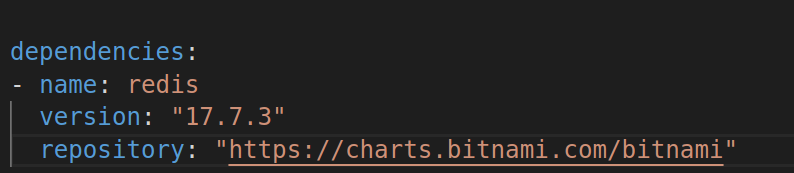
---
first we install dependencies on the local chart file
```bash
helm dependency build 
```
then we build our python app chart 
```bash
helm install python-app-realse-1 ./ziad-app
```
screenshot from curling the node at nodeport 30002
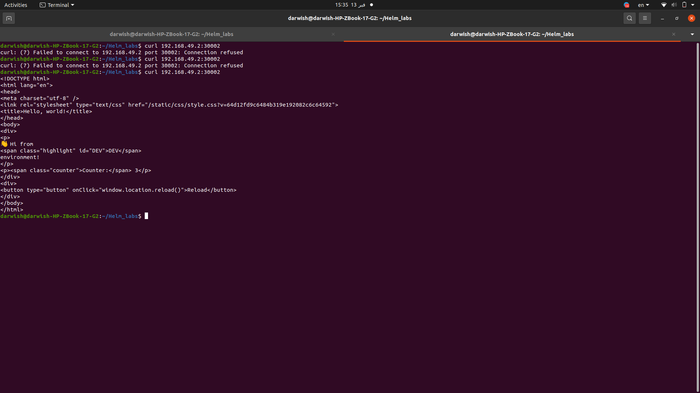
screenshot from the browser
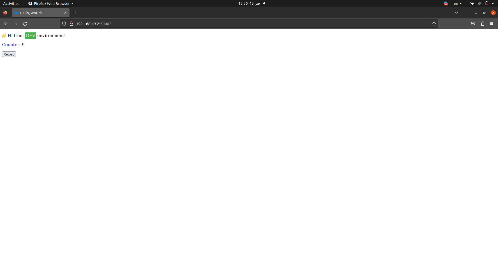

